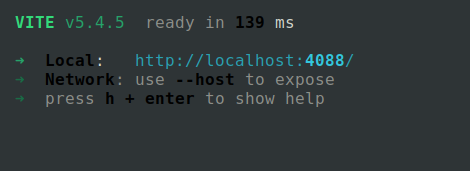

# Guía de Instalación y Uso - **Prueba Técnica**

Este proyecto es una aplicación cliente-servidor que permite a los administradores gestionar usuarios y a los usuarios registrar sus ingresos. El servidor está conectado a una base de datos en MongoDB Atlas.

### Requisitos

- **Node.js** instalado en tu máquina.
- **Conexión a internet** (la base de datos está alojada en MongoDB Atlas).
- **Git** para clonar el repositorio.

---

## Pasos para la Instalación

### 1. Clonar el Repositorio

En la terminal, clona el repositorio utilizando el siguiente comando:

```
git clone https://github.com/Juandiegogb/PruebaTecnicaMejorada
```

---

## Correr la Aplicación

### 2. Correr el Cliente

En una nueva consola, navega a la carpeta del cliente y ejecuta los siguientes comandos:

```
cd PruebaTecnicaMejorada
cd client
npm install
npm run dev
```

Esto iniciará el servidor de desarrollo para el cliente, que estará accesible en tu navegador.

### 3. Correr el Servidor

Abre una **nueva consola** y navega a la carpeta del servidor:

```
cd PruebaTecnicaMejorada
cd server
npm install
npm run dev
```

Esto iniciará el servidor backend.

---

## Instrucciones de Uso

### **Acceso como Administrador**

1. Abre el navegador y accede a la URL o desde la consola utiliza CTRL + CLICK para abrir el enlace de vite.

2. Inicia sesión con las siguientes credenciales:

    - **Usuario**: \`jdiego\`
    - **Contraseña**: \`1234456\`

3. En el panel izquierdo, verás la lista de usuarios almacenados en la base de datos. Puedes agregar nuevos usuarios utilizando el formulario disponible.

### **Acceso como Usuario**

1. Ingresa con las credenciales de algún usuario creado previamente.
2. En el panel izquierdo, verás tus registros de ingresos anteriores. El sistema está configurado para permitir un solo registro por día, simulando el ingreso laboral en la mañana.
